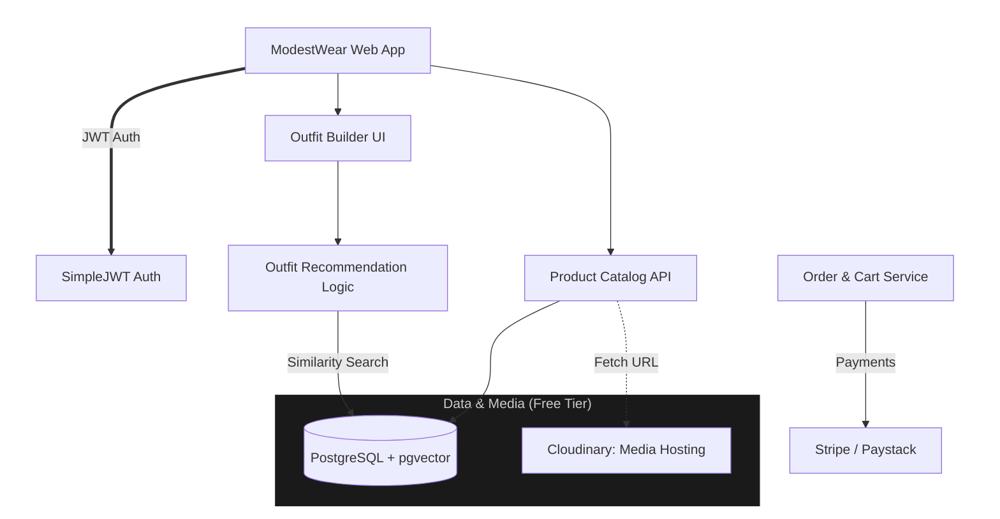

# Modest Wear.
ModestWear is a mobile-first fashion e-commerce website offering elegant and modest
women’s clothing.

## Project Goals
CRUD APIs: Build APIs for managing products, categories, and user authentication.<br>
Filtering, Sorting, Pagination: Implement robust logic for efficient product discovery.<br>
Database Optimization: Design a high-performance database schema to support seamless queries.

## Technologies Used
Django: For building a scalable backend framework.<br>
PostgreSQL: As the relational database for optimized performance.<br>
JWT: For secure user authentication.<br>
Swagger/OpenAPI: To document and test APIs.

## System architecture

## Project structure

```
modestwear/
├── core/                       # Project root 
│   ├── settings.py             # Base, Dev, and Production settings
│   ├── urls.py                 # Root URL config (includes all app URLs)
│   ├── wsgi.py / asgi.py       # Deployment entry points
├── apps/                       # Subdirectory for all business logic
│   ├── users/                  # Custom User model, Profiles, JWT logic
│   │   ├── api/                # API layer for this app
│   │   │   ├── serializers.py
│   │   │   └── views.py
│   │   ├── models.py
│   │   └── urls.py
│   ├── catalog/                # Product Discovery, Filters, Search
│   │   ├── api/
│   │   │   ├── serializers.py
│   │   │   └── views.py
│   │   ├── models.py
│   │   └── services.py         # Business logic (e.g., complex search)
│   ├── orders/                 # Cart, Checkout, Stripe Webhooks
│   ├── outfits/                # Outfit Builder & pgvector logic
├── static/                     # Collected static files (for Swagger/Admin)
├── tests/                      # Global integration tests
├── .env                        # Environment variables (DB_URL, SECRET_KEY)
├── docker-compose.yml          # Setup for Local Postgres & Redis
├── requirements.txt            # Dependencies (DRF, Simple-JWT, pgvector)
└── manage.py
```

git filter-branch -f --env-filter '
OLD_EMAIL=""
CORRECT_NAME="NgangaKamau3"
CORRECT_EMAIL="your-verified-github-email@example.com"
if [ "$GIT_COMMITTER_EMAIL" = "$OLD_EMAIL" ]
then
    export GIT_COMMITTER_NAME="$CORRECT_NAME"
    export GIT_COMMITTER_EMAIL="$CORRECT_EMAIL"
fi
if [ "$GIT_AUTHOR_EMAIL" = "$OLD_EMAIL" ]
then
    export GIT_AUTHOR_NAME="$CORRECT_NAME"
    export GIT_AUTHOR_EMAIL="$CORRECT_EMAIL"
fi
' --tag-name-filter cat -- --branches --tags