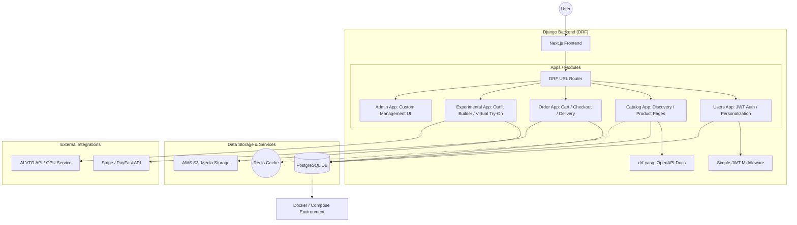

# Modest Wear.
ModestWear is a mobile-first fashion e-commerce website offering elegant and modest
women’s clothing.

## Project Goals
CRUD APIs: Build APIs for managing products, categories, and user authentication. 
Filtering, Sorting, Pagination: Implement robust logic for efficient product discovery. 
Database Optimization: Design a high-performance database schema to support seamless queries.

## Technologies Used
Django: For building a scalable backend framework. 
PostgreSQL: As the relational database for optimized performance. 
JWT: For secure user authentication. 
Swagger/OpenAPI: To document and test APIs.

### System architecture

