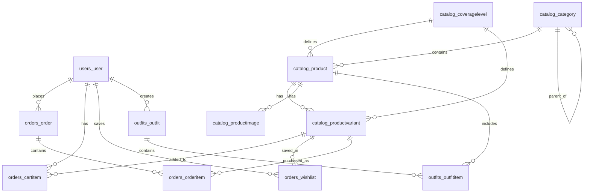

# Database Architecture

ModestWear uses PostgreSQL 15 with a normalized relational schema optimized for e-commerce operations.

## Overview

- **Database:** PostgreSQL 15 (Neon Serverless)
- **Total Tables:** 11
- **Modules:** 4 (Users, Catalog, Orders, Outfits)
- **Connection Pooling:** 600 seconds (CONN_MAX_AGE)
- **Health Checks:** Enabled

## Entity Relationship Diagram



## Module Breakdown

### 1. Users Module

#### users_user
Core user authentication and profile table.

| Column | Type | Description |
|--------|------|-------------|
| id | SERIAL | Primary key |
| email | VARCHAR(254) | Unique, primary authentication |
| username | VARCHAR(70) | Auto-generated from email |
| password | VARCHAR(128) | Hashed password |
| first_name | VARCHAR(128) | User's first name |
| last_name | VARCHAR(70) | User's last name |
| profile_picture | VARCHAR(100) | Cloudinary URL |
| phone_number | VARCHAR(15) | Contact number |
| is_verified | BOOLEAN | Email verification status |
| is_active | BOOLEAN | Account active status |
| is_staff | BOOLEAN | Admin access |
| is_superuser | BOOLEAN | Superuser access |
| date_joined | TIMESTAMP | Registration date |
| last_login | TIMESTAMP | Last login timestamp |

**Indexes:**
- `email` (UNIQUE)
- `username`

**Design Rationale:**
- Email as primary identifier (more intuitive for e-commerce)
- Separate verification flag for email confirmation
- Profile fields for personalization

### 2. Catalog Module

#### catalog_category
Hierarchical product categories.

| Column | Type | Description |
|--------|------|-------------|
| id | SERIAL | Primary key |
| parent_id | INTEGER | Self-reference for hierarchy |
| name | VARCHAR(255) | Category name |
| slug | VARCHAR(50) | URL-friendly identifier |
| is_active | BOOLEAN | Visibility status |

**Relationships:**
- Self-referencing: `parent_id → catalog_category.id`

**Design Rationale:**
- Hierarchical structure (Clothing → Dresses → Evening Dresses)
- Slug for SEO-friendly URLs
- Soft delete via `is_active`

#### catalog_coveragelevel
Modesty coverage levels (unique to ModestWear).

| Column | Type | Description |
|--------|------|-------------|
| id | SERIAL | Primary key |
| name | VARCHAR(255) | Level name (Full/Moderate/Light) |
| description | TEXT | Detailed description |

**Design Rationale:**
- Separate table for extensibility
- Core differentiator for modest fashion
- Referenced by products and variants

#### catalog_product
Main product catalog.

| Column | Type | Description |
|--------|------|-------------|
| id | SERIAL | Primary key |
| category_id | INTEGER | FK to catalog_category |
| product_size_id | INTEGER | FK to catalog_coveragelevel |
| name | VARCHAR(255) | Product name |
| slug | VARCHAR(50) | URL-friendly identifier |
| description | TEXT | Full product description |
| base_price | DECIMAL(6,2) | Base price before variants |
| is_featured | BOOLEAN | Homepage featured flag |
| date_added | TIMESTAMP | Creation timestamp |

**Indexes:**
- `slug` (UNIQUE)
- `category_id`
- `is_featured`
- `(category_id, is_featured)` composite

**Design Rationale:**
- Base price at product level, variants can adjust
- Featured flag for homepage curation
- Slug for SEO

#### catalog_productvariant
Product variations (size/color combinations).

| Column | Type | Description |
|--------|------|-------------|
| id | SERIAL | Primary key |
| product_id | INTEGER | FK to catalog_product |
| coverage_id | INTEGER | FK to catalog_coveragelevel |
| sku | VARCHAR(255) | Stock Keeping Unit (unique) |
| size | INTEGER | Enum: 0=XS, 1=S, 2=M, 3=L, 4=XL, 5=XXL |
| color | VARCHAR(100) | Color name |
| stock_available | INTEGER | Current stock count |
| is_active | BOOLEAN | Availability status |

**Indexes:**
- `sku` (UNIQUE)
- `product_id`
- `(product_id, is_active)` composite

**Design Rationale:**
- Independent stock tracking per variant
- SKU for inventory management
- Size as integer enum for sorting

#### catalog_productimage
Product images with thumbnails.

| Column | Type | Description |
|--------|------|-------------|
| id | SERIAL | Primary key |
| product_id | INTEGER | FK to catalog_product |
| image | VARCHAR(100) | Cloudinary URL |
| thumbnail | VARCHAR(100) | Auto-generated thumbnail |
| is_feature | BOOLEAN | Main product image |

**Design Rationale:**
- Multiple images per product
- Auto-generated thumbnails (Cloudinary)
- Feature image for listings

### 3. Orders Module

#### orders_wishlist
User saved items.

| Column | Type | Description |
|--------|------|-------------|
| id | SERIAL | Primary key |
| user_id | INTEGER | FK to users_user |
| variant_id | INTEGER | FK to catalog_productvariant |
| added_at | TIMESTAMP | Save timestamp |

**Constraints:**
- UNIQUE(user_id, variant_id)

**Design Rationale:**
- Prevent duplicate wishlist entries
- Track when items were saved
- Links to variants (specific size/color)

#### orders_cartitem
Shopping cart items.

| Column | Type | Description |
|--------|------|-------------|
| id | SERIAL | Primary key |
| user_id | INTEGER | FK to users_user (nullable) |
| session_key | VARCHAR(40) | For guest users |
| variant_id | INTEGER | FK to catalog_productvariant |
| quantity | INTEGER | Item quantity |
| created_at | TIMESTAMP | Added timestamp |

**Indexes:**
- `user_id`
- `session_key`

**Design Rationale:**
- Supports both authenticated and guest users
- Session-based cart for guests
- Quantity validation at application level

#### orders_order
Customer orders.

| Column | Type | Description |
|--------|------|-------------|
| id | SERIAL | Primary key |
| user_id | INTEGER | FK to users_user |
| status | VARCHAR(20) | pending/paid/shipped/delivered/cancelled |
| total_price | DECIMAL(10,2) | Order total |
| address | TEXT | Delivery address |
| created_at | TIMESTAMP | Order timestamp |

**Indexes:**
- `user_id`
- `status`
- `created_at`
- `(user_id, status)` composite

**Design Rationale:**
- Status enum for order lifecycle
- Total price cached for performance
- Address snapshot (not FK to avoid changes)

#### orders_orderitem
Individual items in an order.

| Column | Type | Description |
|--------|------|-------------|
| id | SERIAL | Primary key |
| order_id | INTEGER | FK to orders_order |
| variant_id | INTEGER | FK to catalog_productvariant |
| quantity | INTEGER | Quantity purchased |
| price_at_purchase | DECIMAL(10,2) | Price snapshot |

**Design Rationale:**
- Price history preservation
- Accurate financial records even if product price changes
- Links to variant for product details

### 4. Outfits Module

#### outfits_outfit
User-created outfit combinations.

| Column | Type | Description |
|--------|------|-------------|
| id | SERIAL | Primary key |
| user_id | INTEGER | FK to users_user |
| name | VARCHAR(255) | Outfit name |
| description | TEXT | Outfit description |
| is_public | BOOLEAN | Community sharing flag |
| created_at | TIMESTAMP | Creation timestamp |
| updated_at | TIMESTAMP | Last update timestamp |

**Indexes:**
- `user_id`
- `is_public`

**Design Rationale:**
- Public sharing for community features
- Timestamps for sorting/filtering
- Foundation for recommendations

#### outfits_outfititem
Products in an outfit.

| Column | Type | Description |
|--------|------|-------------|
| id | SERIAL | Primary key |
| outfit_id | INTEGER | FK to outfits_outfit |
| product_id | INTEGER | FK to catalog_product |
| position | INTEGER | Display order |

**Constraints:**
- UNIQUE(outfit_id, product_id)

**Design Rationale:**
- Position for ordered display
- Prevent duplicate products in outfit
- Links to product (not variant) for flexibility

## Key Relationships

### One-to-Many (1:N)
- User → Orders
- User → Cart Items
- User → Wishlist Items
- User → Outfits
- Category → Products
- Product → Variants
- Product → Images
- Order → Order Items
- Outfit → Outfit Items

### Many-to-One (N:1)
- Products → Category
- Products → Coverage Level
- Variants → Product
- Variants → Coverage Level
- Cart Items → Variant
- Wishlist → Variant
- Order Items → Variant

### Self-Referencing
- Category → Category (parent-child hierarchy)

## Performance Optimizations

### Indexes
- All foreign keys indexed
- Unique constraints on slugs, SKUs, emails
- Composite indexes for common query patterns
- Full-text search indexes on product name/description

### Connection Pooling
```python
CONN_MAX_AGE = 600  # 10 minutes
CONN_HEALTH_CHECKS = True
```

### Query Optimization
- `select_related()` for foreign keys
- `prefetch_related()` for reverse relationships
- Pagination on all list endpoints

## Scalability Considerations

1. **Horizontal Scaling:** Stateless design allows multiple app servers
2. **Read Replicas:** PostgreSQL supports read replicas for heavy read loads
3. **Caching:** Redis layer for frequently accessed data
4. **Partitioning:** Orders table can be partitioned by date if needed
5. **Archiving:** Old orders can be moved to archive tables

## Future Enhancements

- **pgvector Extension:** For AI-powered recommendations
- **PostGIS:** For location-based features
- **Audit Tables:** Track all data changes
- **Soft Deletes:** Add deleted_at timestamps

## Next Steps

- Learn about [Deployment](deployment.md)
- Explore [Security](security.md)
